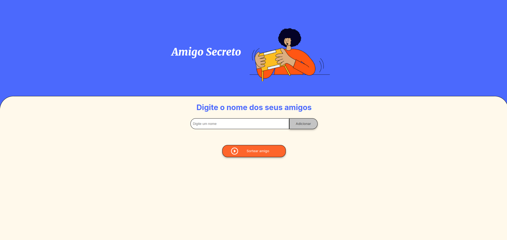

# ONE - Challenge Amigo Secreto


<hr/>

## Como começar? ?
- Faca um clone do projeto:
 ```bash
git clone https://github.com/Gguife/ONE-challenge
```
- Abra o arquivo em sua IDE e divirta-se

## 🛠️ Ferramentas utilizadas:
- html
- css
- Javascript

# Sobre o projeto:
O objetivo foi simular um sorteio para o jogo de amigo secreto. O projeto teve como iniciativa a prática de lógica de programação, com a criação de funções para adicionar, listar e sortear amigos. 
Nele, utilizamos a manipulação do HTML com o DOM, loops, uso de arrays, além das bibliotecas Math.random para números aleatórios e Math.floor para arredondamento.
